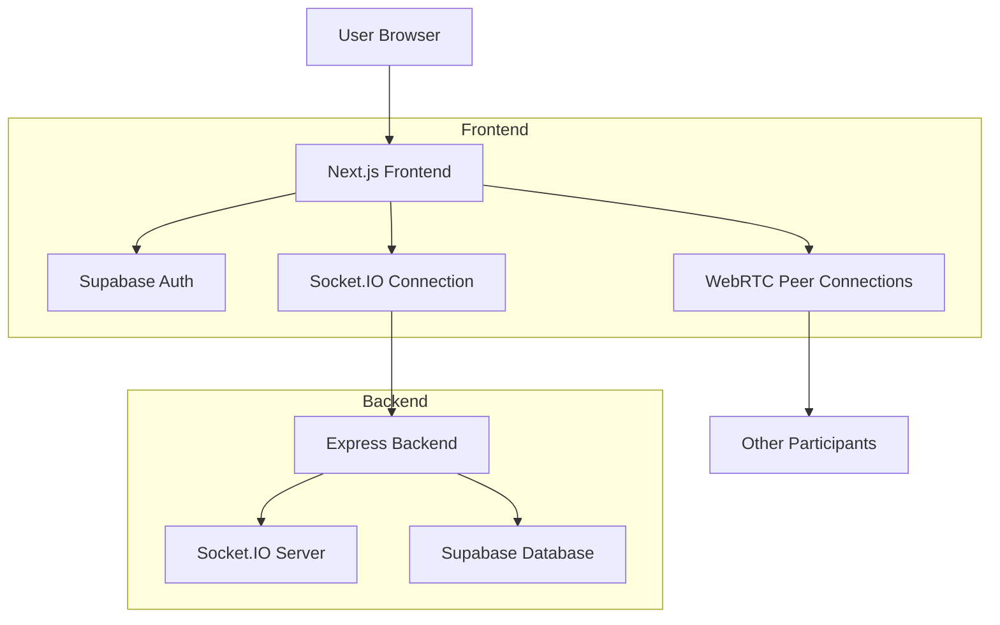

# CollabAI Application Documentation

## What is CollabAI?

CollabAI is an advanced video conferencing platform that enhances virtual meetings with AI-powered features. It goes beyond traditional video calling by providing real-time transcription, intelligent meeting summaries, collaborative tools, and enterprise-grade security. The platform is designed for teams and organizations that want to maximize productivity and collaboration during virtual meetings.

## Key Features

1. **AI-Powered Transcription**: Real-time speech-to-text transcription using browser-based Web Speech API
2. **Smart Meeting Summaries**: Automatic generation of meeting summaries and action items
3. **Secure Video Conferencing**: WebRTC-based peer-to-peer video calling with end-to-end encryption
4. **Collaborative Tools**: Integrated chat system, whiteboard, and screen sharing capabilities
5. **Meeting Analytics**: Productivity metrics and participant engagement tracking
6. **GDPR Compliance**: Full GDPR compliance with data encryption, consent management, and audit logging
7. **Meeting Scheduling**: Calendar integration for scheduling and managing meetings
8. **Recording**: Built-in meeting recording functionality

## How It Works

### 1. User Authentication
- Users sign up or log in using email authentication
- Supabase handles user authentication and session management
- Role-based access control ensures appropriate permissions

### 2. Meeting Creation and Joining
- Users can create instant meetings or schedule future meetings
- Meeting URLs are generated for sharing with participants
- When participants join, they're connected via WebRTC for peer-to-peer communication

### 3. Video Conferencing
- WebRTC technology enables high-quality, low-latency video and audio communication
- Peer-to-peer connections reduce server load and improve performance
- STUN/TURN servers handle NAT traversal for reliable connections

### 4. AI-Powered Transcription
- Browser-based Speech Recognition API captures audio from participants
- Real-time transcription is processed and displayed to all participants
- Transcripts are saved to the database for future reference
- Multi-user transcription support identifies speakers and separates their contributions

### 5. Data Management
- Supabase PostgreSQL database stores meeting information, transcripts, and user data
- Row-level security ensures users only access their own data
- GDPR compliance features protect user privacy and data rights

### 6. Collaboration Features
- Integrated chat system for text communication during meetings
- Whiteboard tool for visual collaboration
- Meeting controls for muting, camera toggling, and recording

## Technology Stack

### Frontend
- **Next.js 14**: React framework for building the web application
- **TypeScript**: Strongly typed programming language for better code quality
- **Tailwind CSS**: Utility-first CSS framework for responsive design
- **Framer Motion**: Animation library for smooth UI transitions
- **Shadcn UI**: Component library built on Radix UI and Tailwind CSS
- **Socket.IO Client**: Real-time communication with the backend
- **WebRTC**: Browser APIs for peer-to-peer communication
- **Web Speech API**: Browser-based speech recognition for transcription

### Backend
- **Node.js with Express**: Server-side runtime and framework
- **Socket.IO**: Real-time bidirectional event-based communication
- **Supabase**: Database and authentication services
- **Hosting**: The backend is hosted on Render platform as a web service

### Database
- **PostgreSQL**: Relational database for storing application data
- **Supabase**: Managed PostgreSQL with additional features
  - Row-level security for data protection
  - Real-time subscriptions for live updates
  - Built-in authentication

### Infrastructure
- **Vercel**: Frontend deployment platform
- **Render**: Backend hosting platform
- **Supabase**: Database and authentication services
- **WebRTC**: Peer-to-peer communication protocol

## Why CollabAI is Unique

### 1. Browser-Based AI Transcription
Unlike many competitors that require external services or plugins, CollabAI leverages the browser's built-in Speech Recognition API for real-time transcription. This approach:
- Reduces latency
- Improves privacy (data doesn't leave the browser)
- Eliminates dependency on external APIs
- Works offline for basic functionality

### 2. Multi-User Transcription with Speaker Identification
CollabAI uniquely handles transcription in multi-participant meetings:
- Identifies and separates different speakers
- Maintains speaker context throughout the meeting
- Provides accurate transcripts even with multiple participants speaking

### 3. Comprehensive GDPR Compliance
The platform implements full GDPR compliance with:
- End-to-end encryption
- Granular consent management
- Data portability features
- Right to erasure implementation
- Audit logging for transparency

### 4. Integrated Productivity Tools
Beyond basic video calling, CollabAI provides:
- AI-powered meeting summaries
- Action item extraction
- Productivity analytics
- Engagement metrics

### 5. Modern Tech Stack
Built with cutting-edge technologies:
- Next.js 14 with App Router
- TypeScript for type safety
- Tailwind CSS for responsive design
- Real-time communication with Socket.IO

## Architecture Overview

## Security Features

1. **End-to-End Encryption**: WebRTC connections are encrypted
2. **Authentication**: Supabase Auth provides secure user authentication
3. **Row-Level Security**: Database access is controlled at the row level
4. **GDPR Compliance**: Full implementation of GDPR requirements
5. **Data Encryption**: AES-256 encryption for sensitive data
6. **Audit Logging**: Comprehensive logging of data access and processing

## Expected Interview Questions and Answers

### Q1: How does the real-time transcription work in CollabAI?

**A**: CollabAI uses the browser's built-in Web Speech API for real-time transcription. Each participant's browser captures their own audio and converts speech to text locally. The transcriptions are then sent to other participants via Socket.IO connections. This approach has several advantages:
- No external API dependencies
- Better privacy (audio never leaves the user's device)
- Lower latency
- Works offline for basic functionality

The system also handles multi-user scenarios by identifying speakers and maintaining context throughout the conversation.

### Q2: How does WebRTC peer-to-peer communication work in the application?

**A**: WebRTC enables direct browser-to-browser communication without server intervention for media streams:

1. **Signaling**: When a user joins a meeting, Socket.IO handles the signaling process to exchange connection metadata
2. **ICE Candidates**: The system exchanges ICE candidates to find the best connection path
3. **Peer Connections**: Direct peer-to-peer connections are established between participants
4. **Media Streams**: Audio and video streams flow directly between browsers

This approach reduces server load and provides lower latency compared to server-based relay systems.

### Q3: How is GDPR compliance implemented in CollabAI?

**A**: CollabAI implements comprehensive GDPR compliance through several mechanisms:

1. **Data Encryption**: AES-256 encryption for sensitive data at rest and in transit
2. **Consent Management**: Granular consent controls for different data processing activities
3. **Audit Logging**: Comprehensive activity logging for transparency
4. **Data Retention**: Automated cleanup policies based on retention periods
5. **Data Export**: Right to data portability with export functionality
6. **Data Deletion**: Right to erasure with secure deletion capabilities
7. **Privacy by Design**: Architecture built with privacy considerations from the ground up

The implementation includes dedicated GDPR tables in the database and specialized services for managing compliance requirements.

### Q4: How does the application handle scalability?

**A**: The application is designed with scalability in mind:

1. **WebRTC Architecture**: Peer-to-peer connections reduce server load for media streaming
2. **Supabase Scaling**: Managed PostgreSQL database that can scale with demand
3. **Vercel Deployment**: Serverless architecture that automatically scales
4. **Socket.IO Clustering**: Backend can be scaled horizontally with multiple instances
5. **Database Optimization**: Proper indexing and query optimization for performance

The separation of concerns between media streaming (WebRTC) and application logic (Socket.IO/HTTP) allows each component to scale independently.

### Q5: What happens when a user joins a meeting?

**A**: When a user joins a meeting, the following process occurs:

1. **Authentication Check**: The system verifies the user's authentication status
2. **Room Joining**: The user joins a Socket.IO room associated with the meeting
3. **Peer Discovery**: Existing participants are notified of the new user
4. **WebRTC Connection**: Peer-to-peer connections are established between the new user and existing participants
5. **Media Stream Setup**: Audio and video streams are configured and shared
6. **UI Initialization**: The video call interface is displayed with participant videos

The process is designed to be seamless and fast, typically taking just a few seconds.

### Q6: How are meeting transcripts saved and managed?

**A**: Meeting transcripts are handled as follows:

1. **Real-time Capture**: Each participant's browser captures their own speech using Web Speech API
2. **Speaker Identification**: Transcripts include speaker information for multi-user meetings
3. **Real-time Broadcasting**: Transcripts are sent to all participants via Socket.IO
4. **Database Storage**: Finalized transcripts are saved to the Supabase PostgreSQL database
5. **Organization**: Transcripts are associated with specific meetings for easy retrieval

The system differentiates between interim results (real-time display) and final results (storage) to ensure accuracy.

### Q7: How does the application handle network issues or connection failures?

**A**: The application implements several strategies for handling network issues:

1. **Automatic Reconnection**: Socket.IO automatically attempts to reconnect when connections are lost
2. **ICE Candidate Retry**: WebRTC connections retry ICE candidate gathering
3. **Graceful Degradation**: The system continues functioning with reduced features if some connections fail
4. **Error Handling**: Comprehensive error handling for different failure scenarios
5. **User Notifications**: Users are informed of connection issues and reconnection attempts

The system is designed to be resilient and maintain functionality even with intermittent connectivity issues.

### Q8: What security measures are in place to protect user data?

**A**: CollabAI implements multiple layers of security:

1. **End-to-End Encryption**: WebRTC media streams are encrypted
2. **Authentication**: Supabase Auth provides secure user authentication with JWT tokens
3. **Database Security**: Row-level security policies in PostgreSQL
4. **Transport Security**: HTTPS for all communications
5. **Input Validation**: Server-side validation of all user inputs
6. **GDPR Compliance**: Comprehensive data protection measures
7. **Regular Security Audits**: Ongoing security monitoring and updates

These measures work together to provide a secure environment for virtual meetings and collaboration.

## Future Enhancements

1. **Advanced AI Features**: Integration with more sophisticated AI models for better summarization
2. **Mobile Applications**: Native mobile apps for iOS and Android
3. **Integration Marketplace**: Connectors for popular tools like Slack, Microsoft Teams, and Google Calendar
4. **Advanced Analytics**: More detailed productivity and engagement metrics
5. **Custom Branding**: White-label solutions for enterprise customers
6. **Recording Enhancements**: Cloud recording with automatic transcription
7. **Breakout Rooms**: Sub-group functionality for larger meetings

## Conclusion

CollabAI represents a modern approach to virtual collaboration, combining the reliability of WebRTC with the power of AI to create a comprehensive meeting platform. Its browser-based architecture, strong security features, and GDPR compliance make it suitable for enterprise use while maintaining ease of use for individual users.